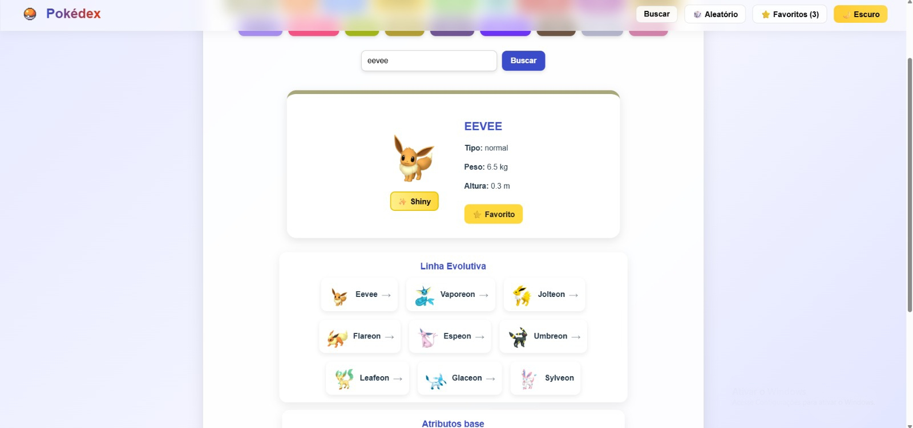

<h1 align="center">⚡ Pokédex API ⚡</h1>

<p align="center">
  
</p>

<p align="center">
  Uma Pokédex moderna feita em <b>React + Vite</b> que consome a <a href="https://pokeapi.co/">PokéAPI</a> 🎮<br>
  Inclui sprites Shiny ✨, modo escuro 🌙, sons personalizados 🔊, favoritos ⭐ e gráficos de atributos 📊!
</p>

---

## 🖼️ Preview do projeto

> 💡 Este é um print real do seu projeto rodando:
>
> 

---

## 🚀 Funcionalidades principais

- 🔍 **Busca dinâmica** com sugestões automáticas  
- 🎲 **Pokémon aleatório** com som e flash de pokébola  
- ✨ **Alternar versão Shiny** (com som especial)  
- ⭐ **Favoritos** com armazenamento local (`localStorage`)  
- 🌈 **Listagem por tipo** (Fire, Water, Fairy, etc.)  
- 🧬 **Linha evolutiva clicável**  
- 📊 **Gráfico de atributos base** com Recharts  
- 🌙 **Modo escuro e claro** com transição suave  
- 🔊 **Efeitos sonoros** personalizados e animados  

---

## 🧠 Tecnologias utilizadas

| Tecnologia | Função |
|-------------|---------|
| ⚛️ **React + Vite** | Estrutura e build do app |
| 🎨 **CSS puro** | Estilização moderna e responsiva |
| 📊 **Recharts** | Gráficos dos atributos base |
| 🌐 **PokéAPI** | Dados oficiais dos Pokémon |
| 💾 **LocalStorage** | Salvar favoritos |
| 🔊 **Sons em MP3** | Pokébola, shiny e aparecimento |

---

## 🌐 APIs utilizadas

| Descrição | Endpoint |
|------------|-----------|
| Lista geral de Pokémons | `https://pokeapi.co/api/v2/pokemon?limit=1000` |
| Detalhes de um Pokémon | `https://pokeapi.co/api/v2/pokemon/{nome}` |
| Espécie e Evolução | `https://pokeapi.co/api/v2/pokemon-species/{nome}` + `https://pokeapi.co/api/v2/evolution-chain/{id}` |
| Pokémons por tipo | `https://pokeapi.co/api/v2/type/{tipo}` |
| Sprites modernas | `https://img.pokemondb.net/sprites/home/...` |
| Sprites clássicas (fallback) | `https://raw.githubusercontent.com/PokeAPI/sprites/...` |

---

## 💻 Como executar o projeto

```bash
# Clone o repositório
git clone https://github.com/LeticiaCGarcia/PokedexAPI.git

# Entre na pasta
cd PokedexAPI

# Instale as dependências
npm install

# Execute o projeto
npm run dev
